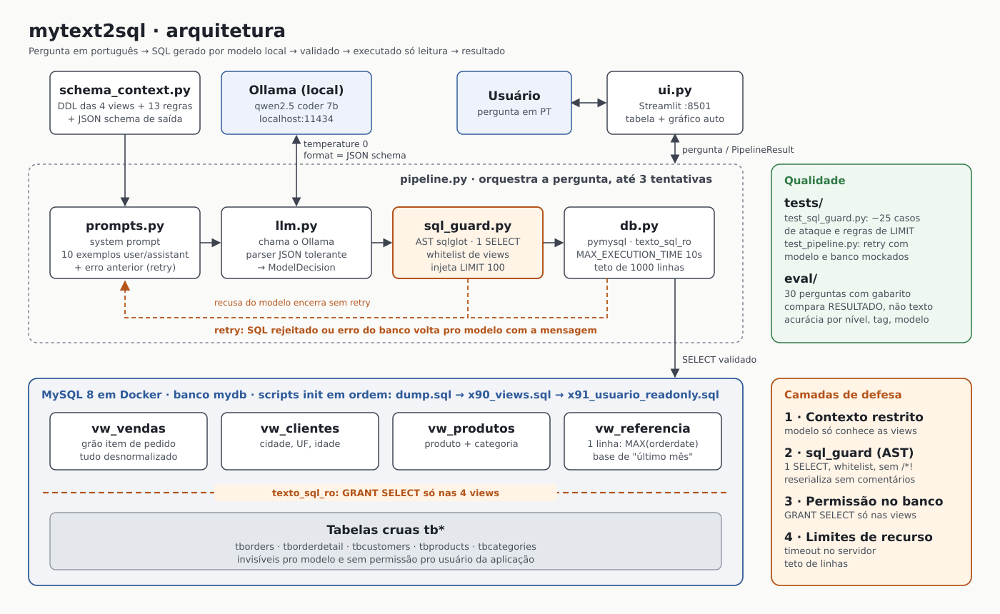

# mytext2sql

Text-to-SQL em portugues para perguntas sobre vendas: um modelo local no
Ollama gera o SQL a partir da pergunta, o sistema valida, executa no banco
(somente leitura) e mostra o resultado.

O modelo nunca ve as tabelas cruas (`tb*`), so as 4 views semanticas em
`mysql/x90_views.sql`. Duas camadas de seguranca: validacao do SQL em
`app/sql_guard.py` e um usuario de banco (`texto_sql_ro`) com `GRANT SELECT`
apenas nas views.



## Pre-requisitos

- Docker Desktop
- [Ollama](https://ollama.com) instalado e rodando (`http://localhost:11434`)
- Python 3.11+ (testado com 3.12; veja a nota sobre pandas/Smart App Control abaixo)

## 1. Subir o banco

```powershell
ollama pull qwen2.5-coder:7b   # ou o modelo que preferir
cd mysql
docker compose up -d
```

Isso sobe o MySQL 8 com o banco `mydb` (dump em `dump.sql`) e, numa
primeira inicializacao (volume vazio), roda automaticamente, nessa ordem:

1. `dump.sql` — schema e carga de dados
2. `x90_views.sql` — views semanticas (`vw_vendas`, `vw_clientes`, `vw_produtos`, `vw_referencia`)
3. `x91_usuario_readonly.sql` — usuario `texto_sql_ro`, somente leitura nas views

Se o container **ja existir** com um volume de dados antigo, esses dois
ultimos scripts nao rodam sozinhos (o MySQL so processa
`/docker-entrypoint-initdb.d` na primeira inicializacao do volume). Aplique-os
manualmente:

```powershell
docker cp mysql/x90_views.sql mysql_mydb:/tmp/x90_views.sql
docker exec mysql_mydb mysql -uroot -pmypswd -e "source /tmp/x90_views.sql"

docker cp mysql/x91_usuario_readonly.sql mysql_mydb:/tmp/x91_usuario_readonly.sql
docker exec mysql_mydb mysql -uroot -pmypswd -e "source /tmp/x91_usuario_readonly.sql"
```

## 2. Ambiente Python

```powershell
python -m venv .venv
.\.venv\Scripts\Activate.ps1
pip install -r requirements.txt
copy .env.example .env
```

Ajuste `.env` se os valores padrao (porta, senha, modelo) forem diferentes
no seu ambiente. A senha padrao de `texto_sql_ro` ja vem definida em
`mysql/x91_usuario_readonly.sql` e repetida em `.env.example` — troque as
duas se for usar isso em algo alem de uma maquina de desenvolvimento local.

### Nota: pandas e o "Controle de Aplicativo" do Windows (Smart App Control)

Se `import pandas` falhar com `DLL load failed ... Uma politica de Controle
de Aplicativo bloqueou este arquivo`, o Smart App Control do Windows 11
bloqueou um `.pyd` do pandas por falta de reputacao (comum em builds muito
recentes, ex.: pandas 3.0.x). `requirements.txt` ja fixa `pandas==2.2.3`
(uma versao bem mais antiga e conhecida) para evitar o problema; se mesmo
assim acontecer, veja Config. de Seguranca do Windows > Isolamento do nucleo
> Controle de Aplicativo Inteligente, ou rode `Get-WinEvent -LogName
"Microsoft-Windows-CodeIntegrity/Operational"` para achar o arquivo exato
bloqueado.

## 3. Rodar a aplicacao

```powershell
streamlit run app/ui.py
```

Abre em `http://localhost:8501`. Digite a pergunta em portugues (ex.: "qual
o faturamento por categoria em 2024?") e clique em Perguntar.

## 4. Testes

```powershell
pytest tests/ -v
```

## 5. Avaliacao (eval/)

`eval/perguntas.yaml` tem 30 perguntas com SQL gabarito (validado contra o
banco), nivel e tags. `eval/run_eval.py` roda o pipeline completo em cada
pergunta e compara o **resultado da execucao** (nao o texto do SQL) com o
gabarito: mesmo conjunto de linhas, ignorando ordem quando o gabarito nao
tem `ORDER BY`, com tolerancia de 0.01 em valores decimais.

```powershell
python eval/run_eval.py
python eval/run_eval.py --model qwen2.5-coder:7b
python eval/run_eval.py --model llama3.1:8b --saida eval/relatorio_llama.csv
```

Gera um relatorio no terminal (acuracia geral, por nivel, por tag, media de
tentativas, tempo medio) e um CSV com o detalhe de cada pergunta.

## Evaluation results

*qwen2.5-coder:7b running locally on Ollama · 30 benchmark questions with gold SQL · strict execution match*

| 76.7% (23/30) | 2/2 | 1.07 | 28.5s |
|---|---|---|---|
| Strict accuracy | Write requests correctly refused | Average attempts per question | Median latency per question |

**By difficulty**

| Level | Correct | % |
|---|---|---|
| Easy | 10/13 | 77% |
| Medium | 10/12 | 83% |
| Hard | 3/5 | 60% |

**By capability**

| Capability | Correct |
|---|---|
| Aggregation | 16/17 |
| Geography | 4/4 |
| Refusal | 2/2 |
| Relative dates | 3/4 |
| Ranking | 4/6 |
| Category translation | 4/6 |
| Text search | 0/2 |
| Comparison | 0/2 |

Reading the numbers: the benchmark is deliberately strict — a question only
counts if the result has exactly the same columns and rows as the gold SQL.
Of the 7 misses, only 1 is a clear model error (an empty result on a relative
date question). 3 returned the right answer in a different shape (extra
columns or a side-by-side layout) and 3 need SQL-level review. Only 2
questions needed a retry, and both were answered correctly. Next step: log
the generated SQL and report a lenient metric next to the strict one.

Brings data platform discipline to GenAI: semantic layer, least-privilege
access and measurable accuracy — the things that separate a production-ready
assistant from a demo.

## Notas importantes sobre o banco

- O motor rodando e **MySQL 8.0** (a imagem Docker usa `mysql:8.0`), apesar
  de `docs/data_dictionary.md` mencionar MariaDB. O SQL gerado e validado
  usa o dialeto MySQL, mas evita funcoes exclusivas de um dos dois motores.
- A categoria de codigo 1 esta armazenada como `'Digital Books'` no banco
  rodando atualmente (o dicionario e o `dump.sql` dizem `'Books'`; os dados
  do volume ja existente divergiram do arquivo em algum momento). O prompt
  do modelo (`app/schema_context.py`) usa o valor real do banco:
  `livros -> 'Digital Books'`.
